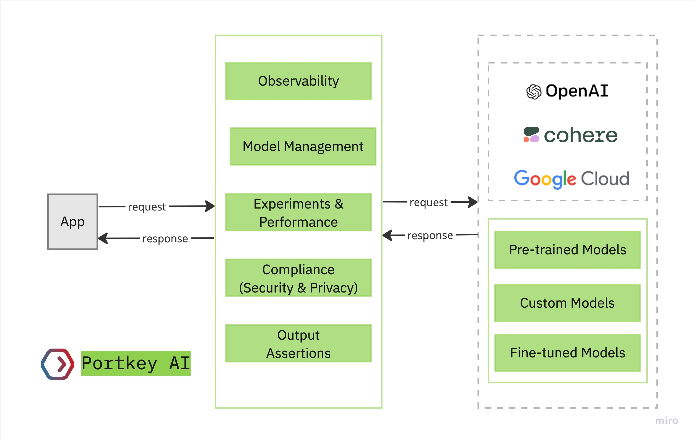

# 👋 Welcome to Portkey!

Building prototypes on top of LLMs is a **very different** problem from scaling them to production

As your app starts to scale, you are likely to encounter challenges you haven't seen before. Challenges like:

* Increasing latencies
* Request failures with unexplainable errors
* Rate limiting
* Poor visibility
* Abuse of systems
* Poor key management
* Privacy complications with client data
* ...and more.

Portkey is engineered to address **all** these challenges and augment your LLM systems with additional production capabilities—requiring minimal modifications to your existing code.

<figure><figcaption>
Snapshot of how Portkey works
</figcaption></figure>

#### **Dive into Portkey's production-grade features below or use ⌘+K (or Ctrl+K) for immediate assistance.**
