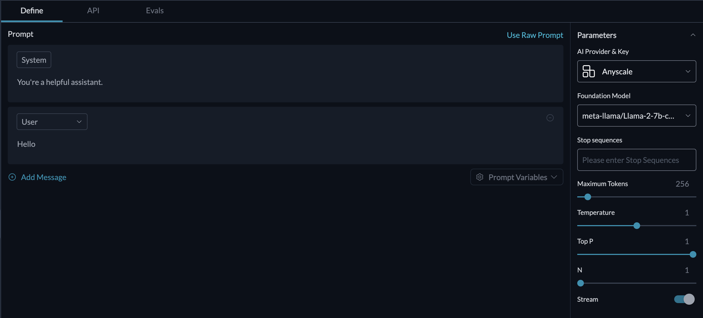

# ➡ Anyscale (Llama 2 & Mistral 7B)

### Models Supported

<table><thead><tr><th width="238">Model Name</th><th>Model Key on Portkey</th></tr></thead><tbody><tr><td><a href="https://d3qavlo5goipcw.cloudfront.net/supported-models/meta-llama-Llama-2-7b-chat-hf/">Llama 2 - 7B</a></td><td><code>meta-llama/Llama-2-7b-chat-hf</code></td></tr><tr><td><a href="https://d3qavlo5goipcw.cloudfront.net/supported-models/meta-llama-Llama-2-13b-chat-hf/">Llama 2- 13B</a></td><td><code>meta-llama/Llama-2-13b-chat-hf</code></td></tr><tr><td><a href="https://d3qavlo5goipcw.cloudfront.net/supported-models/meta-llama-Llama-2-70b-chat-hf/">Llama 2 - 70B</a></td><td><code>meta-llama/Llama-2-70b-chat-hf</code></td></tr><tr><td><a href="https://d3qavlo5goipcw.cloudfront.net/supported-models/codellama-CodeLlama-34b-Instruct-hf/">Code Llama - 34B</a></td><td><code>codellama/CodeLlama-34b-Instruct-hf</code></td></tr><tr><td><a href="https://d3qavlo5goipcw.cloudfront.net/supported-models/mistralai-Mistral-7B-Instruct-v0.1/">Mistral - 7B</a></td><td><code>mistralai/Mistral-7B-Instruct-v0.1</code></td></tr></tbody></table>

### Adding Virtual Keys

1. Sign up for Anyscale endpoints [here](https://app.endpoints.anyscale.com/welcome) and generate credentials [here](https://app.endpoints.anyscale.com/credentials).
2. Paste it in the Virtual key modal on [Portkey](https://app.portkey.ai/) below, add any notes, and you're done.

<div align="left">

<figure><figcaption></figcaption></figure>

</div>

### How to Use



Install the SDK & Export Portkey API Key

```bash
$ pip install portkey-ai
$ export PORTKEY_API_KEY="PORTKEY_API_KEY"
```

Let's make a call using Llama2 - 70B

```python
import portkey
from portkey import Config, LLMOptions

portkey.config = Config(
    mode="single", 
    llms=LLMOptions(provider="anyscale", virtual_key=anyscale-xxx)
)

response = portkey.ChatCompletions.create(
    model="meta-llama/Llama-2-70b-chat-hf", # Pick any anyscale model 
    messages=[
        {"role": "user", "content": "Hello!"}
    ]
)

print(response)
```



Install the SDK & Export Portkey API Key

```bash
$ npm install portkey-ai
$ export PORTKEY_API_KEY="PORTKEY_API_KEY"
```

Let's make a call using Llama2 - 70B

```javascript
import { Portkey } from "portkey-ai";

const portkey = new Portkey({
    mode: "single",
    llms: [{ provider: "anyscale", virtual_key: "anyscale-xxx" }]
});

async function main() {
    const chatCompletion = await portkey.chat.completions.create({
        messages: [{ role: 'user', content: 'Say this is a test' }],
        model: 'meta-llama/Llama-2-70b-chat-hf'
    });

    console.log(chatCompletion.choices);
};

main();
```



You can also make a direct curl request through Portkey API

```bash
curl 'https://api.portkey.ai/v1/chatComplete' \
     -H 'x-portkey-api-key: PORTKEY_API_KEY' \
     -H 'Content-Type: application/json' \
     -d '{ 
        "config": { 
            "provider": "anyscale",
            "api_key": "ANYSCALE_API_KEY"
        },
        "params": {
            "messages": [{"role": "user","content":"What are the ten tallest buildings in India?"}],
            "model": "mistralai/Mistral-7B-Instruct-v0.1"
        }
    }'
```



You can directly use Porktey inside Llamaindex and make your Llamaindex apps production-grade with Portkey's features.

First, install Portkey Python SDK

```bash
$ pip install -U portkey-ai
$ export PORTKEY_API_KEY="PORTKEY_API_KEY"
```

Here's how you can use Anyscale through Portkey with Llamaindex:

```python
from llama_index.llms import Portkey, ChatMessage
import portkey

# Creating the Portkey client
portkey_client = Portkey(mode="single")

# Creating our Anyscale LLM
anyscale_llm = portkey.LLMOptions(provider="anyscale", model="mistralai/Mistral-7B-Instruct-v0.1", virtual_key="anyscale-xxx")

# Adding the LLM to Portkey client to activate it
portkey_client.add_llms(anyscale_llm)

# Our prompt
messages = [
    ChatMessage(role="system", content="You are a helpful assistant"),
    ChatMessage(role="user", content="What can you do?"),
]

# Making the call

response = portkey_client.chat(messages)

print(response)
```



### Prompt Templates

You can also use Anyscale endpoints with Portkey prompt templates

<figure><figcaption></figcaption></figure>

Add Anyscale keys to your Portkey account and head over to the **Models** page - you should see Anyscale options in the AI Provider & Models dropdown.
