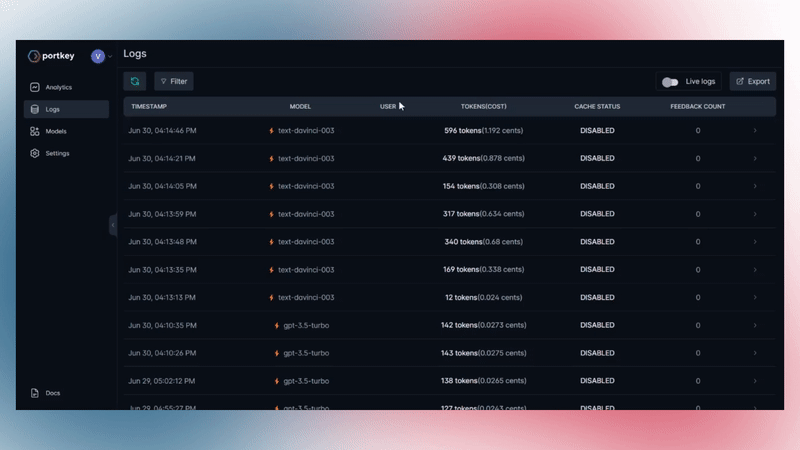

# ⏮ Request Tracing

Having end-to-end visibility of your requests is crucial. Portkey supports request tracing to help you monitor your applications throughout the lifecycle of a request.

To enable tracing, you can pass a `trace-id` in the header of any request made via Portkey. This trace ID will be associated with the journey of the request, from initiation to completion, providing insights into the entire process.

### How to Enable Request Tracing

To enable tracing, include the `x-portkey-trace-id` in your request header.

```javascript
{
    "x-portkey-trace-id": "<YOUR TRACE ID>"
}
```

### Tracing and User Feedback

Trace IDs can also be used to link user feedback to specific generations. This can be used in a system where users provide feedback, like a thumbs up or thumbs down, or something more complex via our feedback APIs. This feedback can be linked to traces which can span over a single generation or multiple ones.

You can read more about implementing user feedback in Portkey [here](feedback-api.md).

### **🖥️ Portkey Dashboard Guide**

You can view all the requests with a common `trace-id` easily on the logs page.

<figure><figcaption></figcaption></figure>
