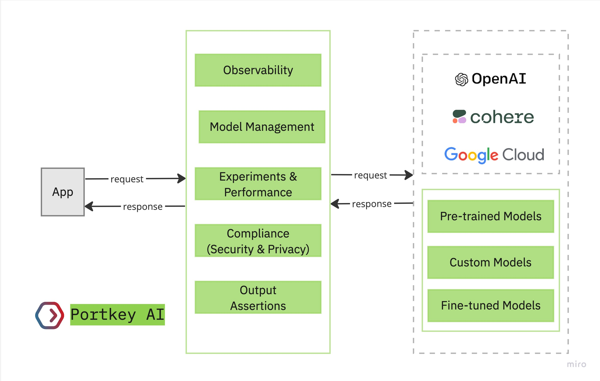

# ℹ Introduction

Portkey is a platform designed to streamline the deployment and management of Generative AI applications. It provides comprehensive features for **monitoring**, **managing models**, and **improving the performance** of your AI applications.

### Product Introduction

Portkey leverages a cutting-edge LLMOps stack to launch production-ready applications. It aims to optimize your AI application's performance with critical components like monitoring and model management. It also includes other essential features such as **Request Tracing**, Request **Caching**, **Automatic Retries** in case of LLM failure, Custom **Metadata**, **Fallbacks** on LLMs, **Load Balancing,** and **more**.

Moreover, Portkey ensures compliance with GDPR, SOC2 and ISO standards, making it a reliable choice for businesses.

<figure><figcaption></figcaption></figure>

