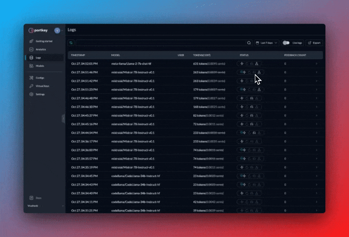

# 📊 Logs & Analytics

One of the many advantages of integrating with Portkey is the detailed logs and analytics provided directly on the Portkey dashboard. Once your application is integrated with Portkey, this feature is enabled automatically, providing you with valuable insights into your application's usage patterns and performance.

This feature does not require any additional headers to be passed in your requests. As soon as the Portkey integration is done, all logs and analytics will begin to appear in the Portkey dashboard.

The Logs and Analytics section is split into two parts:

## 📊 Analytics

The Analytics section of the Portkey dashboard provides a visual and interactive interface for understanding your LLM application  Here, you can see various graphs and metrics related to requests to different LLMs, costs, latencies, tokens, user activity, feedback, cache hits, errors, and much more.

The metrics in the Analytics section can help you understand the overall efficiency of your application, discover patterns, identify areas of optimization, and much more.

## 📋 Logs

The Logs section presents a chronological list of all the requests processed through Portkey. Each log entry provides useful data such as the timestamp, request type, LLM used, tokens generated, and cost. By clicking on an entry, a side panel opens up, revealing the entire raw data with the request and response objects.

This detailed log can be invaluable when troubleshooting issues or understanding specific interactions. It provides full transparency into each request and response, enabling you to see exactly what data was sent and received.

### **🤝 Share Logs with Teammates**

Each log on Portkey has a unique URL. You can just copy the link from the address bar and directly share it with anyone in your org.

<figure><figcaption></figcaption></figure>

### 🚦Request Status Guide

Wondering how your requests are being handled by Portkey? The Status column on the Logs page gives you a snapshot of the gateway activity for every request.

Portkey’s gateway features—[Cache](../ai-gateway/simple-and-semantic-cache.md), [Retries](../ai-gateway/automatic-retries.md), [Fallback](../ai-gateway/fallbacks-on-llms.md), [Loadbalance](../ai-gateway/load-balancing.md)—are all tracked here with their exact states (`disabled`, `triggered`, etc.), making it a breeze to monitor and optimize your usage.

**Common Queries Answered:**

* **Is Caching Working?**: Enabled caching but unsure if it's active? The Status column will confirm it for you.
* **How Many Retries Took Place?**: Curious about the retry count for a successful request? See it with a glance.
* **Fallback and Loadbalance**: Want to know if loadbalance is active or which fallback option was triggered? See it with a glance

<figure><figcaption></figcaption></figure>

<table><thead><tr><th width="195">Option</th><th width="238">🔴 Inactive State</th><th>🟢 Possible Active States</th></tr></thead><tbody><tr><td><strong>Cache</strong></td><td>Cache Disabled</td><td>
Cache Miss,

Cache Refreshed,

Cache Hit,

Cache Semantic Hit
</td></tr><tr><td><strong>Retry</strong></td><td>Retry Not Triggered</td><td>
Retry Success on {x} Tries,

Retry Failed
</td></tr><tr><td><strong>Fallback</strong></td><td>Fallback Disabled</td><td>
Fallback Active,

Fallback Triggered on Option {x}
</td></tr><tr><td><strong>Loadbalance</strong></td><td>Loadbalancer Disabled</td><td>Loadbalancer Active</td></tr></tbody></table>
