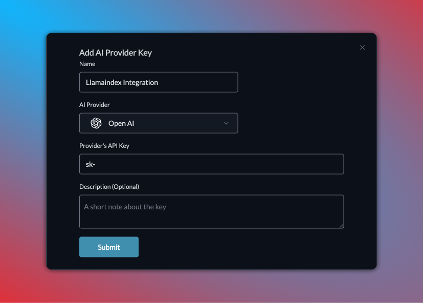

# 🔑 Virtual Keys

### Creating Virtual Keys:

* **Step 1**: Go to the "Virtual Keys" page and click "Add Key" button in the top right corner.
* **Step 2**: Select your AI provider, name your key uniquely, and note any usage specifics if needed.

<figure><figcaption></figcaption></figure>


**Tip:** You can register multiple keys for one provider or use different names for the same key for easy identification.


## Using Virtual Keys

### 1. SDK and Langchain/Llamaindex apps:

Directly add the virtual key while constructing your LLM:

```python
llm = LLMOptions(
        provider="", 
        virtual_key="open-ai-key-xxxx", # Your Virtual Key
        model=""
)
```

### 2. Prompt templates

Select your Virtual Key in Portkey’s prompt templates; it’s automatically fetched and ready to use.

<figure><figcaption></figcaption></figure>

### 3. Client SDKs or Proxy

#### **Step 1: Create config**&#x20;

Add your virtual key while adding your provider under "options" key.

```json
{
    "mode": "single", 
    "options": [ 
        {
            "provider": "openai",
            "virtual_key": "open-ai-key-fb040b"
        }
    ]
}
```

#### **Step 2: Use config**

Pass the Config id using the 'x-portkey-config' header in your calls.

#### **OpenAI**

```python
import openai

openai.api_base = "https://api.portkey.ai/v1/proxy"

portkey_headers = {
    "x-portkey-api-key": "<PORTKEY_API_KEY>",
    "x-portkey-mode": "proxy openai",
    "x-portkey-config": "pc-test-xxx", # Add the Config ID here
}

r = openai.Completion.create(model=model, prompt=prompt, headers=portkey_headers)
```

#### **Rest API**

```bash
curl --location 'http://api.portkey.ai/v1/proxy/completions' \
--header 'x-portkey-api-key: <PORTKEY_API_KEY>' \
--header 'x-portkey-mode: proxy openai' \
--header 'x-portkey-config: pc-test-xxx' \ # Add the Config ID here
--header 'Content-Type: application/json' \
--data '{
    "model": "model",
    "prompt": "prompt"
}'
```
