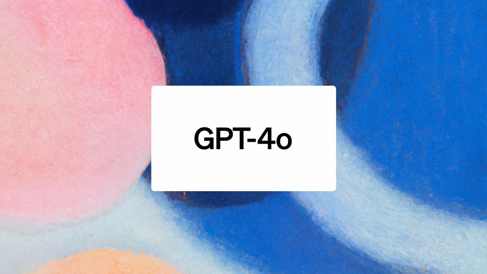

# Detecting Emotions with GPT-4o

<figure><figcaption></figcaption></figure>

## First, grab the API keys

<table data-header-hidden><thead><tr><th width="255"></th><th></th></tr></thead><tbody><tr><td><a href="https://app.portkey.ai/">Portkey API Key</a></td><td><a href="https://platform.openai.com/api-keys">OpenAI API Key</a></td></tr></tbody></table>

```sh
pip install -qU portkey-ai openai
```

## Let's make a request

<pre class="language-py"><code class="lang-py">from openai import OpenAI
<strong>from portkey_ai import PORTKEY_GATEWAY_URL, createHeaders
</strong>
portkey = OpenAI(
<strong>    api_key = 'OPENAI_API_KEY',
</strong><strong>    base_url = PORTKEY_GATEWAY_URL,
</strong><strong>    default_headers = createHeaders(
</strong><strong>        provider = "openai",
</strong><strong>        api_key = 'PORTKEY_API_KEY'
</strong><strong>    )
</strong>)

emotions = portkey.chat.completions.create(
<strong>    model = "gpt-4o",
</strong>    messages = [{"role": "user","content": 
        [
            {"type": "image_url","image_url": {"url": "https://i.insider.com/602ee9d81a89f20019a377c6?width=1136&#x26;format=jpeg"}},
            {"type": "text","text": "What expression is this person expressing?"}
        ]
    }
  ]
)

print(emotions.choices[0].message.content)
</code></pre>

## Get Observability over the request

<figure><figcaption></figcaption></figure>
