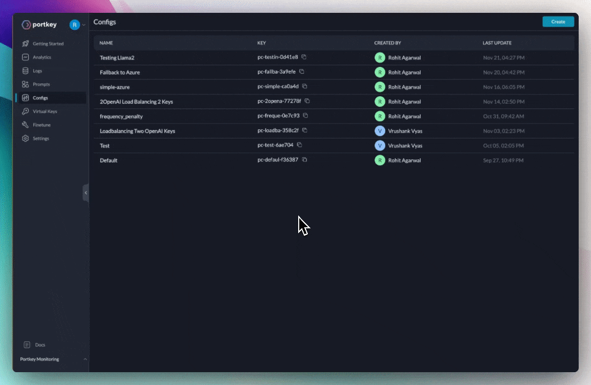

# Configs

Configs streamline your Gateway management, enabling you to programmatically control various aspects like fallbacks, load balancing, retries, caching, and more.&#x20;

A configuration is a JSON object that can be used to define routing rules for all the requests coming to your gateway. You can configure multiple configs and use them in your requests.

## **Creating Configs**

Navigate to the ‘Configs’ page in the Portkey app and click 'Create' to start writing a new config.

<figure><figcaption></figcaption></figure>

## Using Configs

Configs are supported across all integrations.

* Through the config parameter of the Portkey SDK client(Directly or via [frameworks](../../getting-started/integration-guides/))
* Through the config headers in the OpenAI SDK
* Via the REST API through the `x-portkey-config` header

### Applying Gateway Configs

Gateway [configs](configs.md) allow you to unlock the gateway superpowers of Portkey. You can create a config in the UI and attach it's config id in the OpenAI client.



```javascript
const portkey = new Portkey({
    apiKey: "PORTKEY_API_KEY",
    config: "pc-***" // Supports a string config id or a config object
});
```



```python
const portkey = Portkey(
    api_key="PORTKEY_API_KEY",
    config="pc-***" # Supports a string config id or a config object
)
```



<pre class="language-javascript"><code class="lang-javascript">const openai = new OpenAI({
  apiKey: 'OPENAI_API_KEY', // defaults to process.env["OPENAI_API_KEY"],
  baseURL: PORTKEY_GATEWAY_URL,
  defaultHeaders: createHeaders({
    provider: "openai",
    apiKey: "PORTKEY_API_KEY", // defaults to process.env["PORTKEY_API_KEY"]
<strong>    config: "CONFIG_ID" // Fetched from the UI
</strong>  })
});
</code></pre>



<pre class="language-python"><code class="lang-python">client = OpenAI(
    api_key="OPENAI_API_KEY", # defaults to os.environ.get("OPENAI_API_KEY")
    base_url=PORTKEY_GATEWAY_URL,
    default_headers=createHeaders(
        provider="openai",
        api_key="PORTKEY_API_KEY", # defaults to os.environ.get("PORTKEY_API_KEY")
<strong>        config="CONFIG_ID"
</strong>    )
)
</code></pre>



<pre class="language-bash"><code class="lang-bash">curl https://api.portkey.ai/v1/chat/completions \
  -H "Content-Type: application/json" \
  -H "Authorization: Bearer $OPENAI_API_KEY" \
  -H "x-portkey-api-key: $PORTKEY_API_KEY" \
  -H "x-portkey-provider: openai" \ 
<strong>  -H "x-portkey-config: $CONFIG_ID" \ 
</strong>  -d '{
    "model": "gpt-3.5-turbo",
    "messages": [{
        "role": "user",
        "content": "Hello!"
      }]
  }'
</code></pre>



If you want to attach the configuration to only a few requests instead of modifying the client, you can send it in the request headers for OpenAI or in the config parameter while using the Portkey SDK.



<pre class="language-javascript"><code class="lang-javascript">portkey.chat.completions.create({
  messages: [{role: "user", content: "Say this is a test"}],
  model: "gpt-3.5-turbo"
<strong>}, {config: "pc-***"})
</strong></code></pre>



<pre class="language-python"><code class="lang-python"><strong>portkey.with_options(config="pc-***").chat.completions.create(
</strong>    messages = [{ "role": 'user', "content": 'Say this is a test' }],
    model = 'gpt-3.5-turbo'
})
</code></pre>



<pre class="language-javascript"><code class="lang-javascript"><strong>let reqHeaders = createHeaders({config: "CONFIG_ID});
</strong>openai.chat.completions.create({
  messages: [{role: "user", content: "Say this is a test"}],
  model: "gpt-3.5-turbo"
<strong>}, {headers: reqHeaders})
</strong></code></pre>



<pre class="language-python"><code class="lang-python"><strong>reqHeaders = createHeaders(config="CONFIG_ID")
</strong><strong>client.with_options(headers=reqHeaders).chat.completions.create(
</strong>    messages = [{ "role": 'user', "content": 'Say this is a test' }],
    model = 'gpt-3.5-turbo'
})
</code></pre>




You can also add the config JSON as a string instead of the slug.


## Config Object Documentation

The config object is defined here


[config-object.md](../../api-reference/config-object.md)


