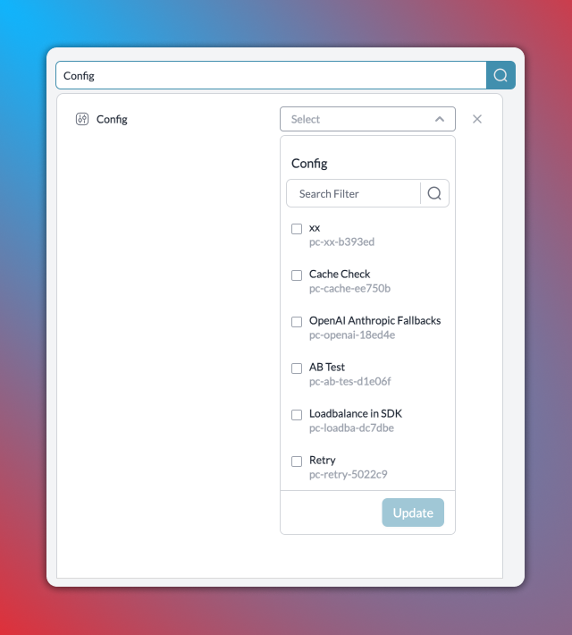

# Fallbacks


This feature is available on all Portkey plans.


With an array of Language Model APIs available on the market, each with its own strengths and specialties, wouldn't it be great if you could seamlessly switch between them based on their performance or availability? Portkey's Fallback capability is designed to do exactly that.

The Fallback feature allows you to specify a list of providers/models in a prioritized order. If the primary LLM fails to respond or encounters an error, Portkey will automatically fallback to the next LLM in the list, ensuring your application's robustness and reliability.

<figure><figcaption></figcaption></figure>

### Enabling Fallback on LLMs

To enable fallbacks, you can modify the [config object](../../api-reference/config-object.md) to include the `fallback` mode.

Here's a quick example of a config to **fallback** to Anthropic's `claude-3.5-sonnet` if OpenAI's `gpt-4o` fails.

```json
{
  "strategy": {
      "mode": "fallback"
  },
  "targets": [
    {
      "virtual_key": "openai-virtual-key",
      "override_params": {
          "model": "gpt-4o"
      }
    },
    {
      "virtual_key": "anthropic-virtual-key",
      "override_params": {
          "model": "claude-3.5-sonnet-20240620"
      }
    }
  ]
}
```

In this scenario, if the OpenAI model encounters an error or fails to respond, Portkey will automatically retry the request with Anthropic.

[Using Configs in your Requests](configs.md#using-configs)

### Triggering fallback on specific error codes

By default, fallback is triggered on any request that returns a **non-2xx** status code.&#x20;

You can change this behaviour by setting the optional **`on_status_codes`** param in your fallback config and manually inputting the status codes on which fallback will be triggered.

<pre><code>{
  "strategy": {
    "mode": "fallback",
<strong>    "on_status_codes": [ 429 ]
</strong>  },
  "targets": [
    {
      "virtual_key": "openai-virtual-key"
    },
    {
      "virtual_key": "azure-openai-virtual-key"
    }
  ]
}
</code></pre>

Here, fallback from OpenAI to Azure OpenAI will only be triggered when there is a **`429`** error code from the OpenAI request (i.e. rate limiting error)

### Tracing Fallback Requests on Portkey

Portkey logs all the requests that are sent as a part of your fallback config. This allows you to easily trace and see which targets failed and see which ones were eventually successful.

To see your fallback trace,

1. On the Logs page, first filter the logs with the specific `Config ID` where you've setup the fallback - this will show all the requests that have been sent with that config.
2. Now, trace an individual request and all the failed + successful logs for it by filtering further on `Trace ID` - this will show all the logs originating from a single request.

<div align="left">

<figure><figcaption></figcaption></figure>

</div>

### Caveats and Considerations

While the Fallback on LLMs feature greatly enhances the reliability and resilience of your application, there are a few things to consider:

1. Ensure the LLMs in your fallback list are compatible with your use case. Not all LLMs offer the same capabilities.
2. Keep an eye on your usage with each LLM. Depending on your fallback list, a single request could result in multiple LLM invocations.
3. Understand that each LLM has its own latency and pricing. Falling back to a different LLM could have implications on the cost and response time.
