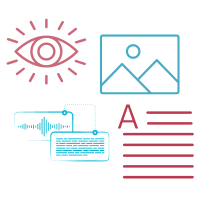

# Multimodal Capabilities


This feature is available on all Portkey plans.


The Gateway is your unified interface for **multimodal models**, along with chat, text, and embedding models.

Using the Gateway, you can call `vision`, `audio (text-to-speech & speech-to-text)`, `image generation` and other multimodal models from multiple providers (like `OpenAI`, `Anthropic`, `Stability AI`, etc.) — all using the familiar OpenAI signature.

<figure><figcaption></figcaption></figure>

#### Explore the AI Gateway's Multimodal capabilities below:


[vision.md](vision.md)



[image-generation.md](image-generation.md)



[function-calling.md](function-calling.md)



[vision-1.md](vision-1.md)



[vision-2.md](vision-2.md)

