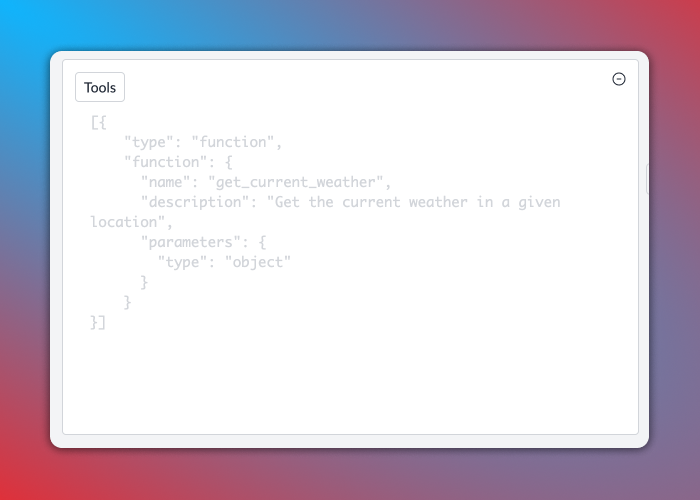

# Function Calling

Portkey's AI Gateway supports function calling capabilities that many foundational model providers offer. In the API call you can describe functions and the model can choose to output text or this function name with parameters.

### Functions Usage

Portkey supports the OpenAI signature to define functions as part of the API request. The `tools` parameter accepts functions which can be sent specifically for models that support function/tool calling.



```javascript
import Portkey from 'portkey-ai';

// Initialize the Portkey client
const portkey = new Portkey({
    apiKey: "PORTKEY_API_KEY",  // Replace with your Portkey API key
    virtualKey: "VIRTUAL_KEY"   // Add your provider's virtual key
});

// Generate a chat completion with streaming
async function getChatCompletionFunctions(){
  const messages = [{"role": "user", "content": "What's the weather like in Boston today?"}];
  const tools = [
      {
        "type": "function",
        "function": {
          "name": "get_current_weather",
          "description": "Get the current weather in a given location",
          "parameters": {
            "type": "object",
            "properties": {
              "location": {
                "type": "string",
                "description": "The city and state, e.g. San Francisco, CA",
              },
              "unit": {"type": "string", "enum": ["celsius", "fahrenheit"]},
            },
            "required": ["location"],
          },
        }
      }
  ];

  const response = await portkey.chat.completions.create({
    model: "gpt-3.5-turbo",
    messages: messages,
    tools: tools,
    tool_choice: "auto",
  });
  
  console.log(response)

}
await getChatCompletionFunctions();
```



```python
from portkey_ai import Portkey

# Initialize the Portkey client
portkey = Portkey(
    api_key="PORTKEY_API_KEY",  # Replace with your Portkey API key
    virtual_key="VIRTUAL_KEY"   # Add your provider's virtual key
)

tools = [
  {
    "type": "function",
    "function": {
      "name": "get_current_weather",
      "description": "Get the current weather in a given location",
      "parameters": {
        "type": "object",
        "properties": {
          "location": {
            "type": "string",
            "description": "The city and state, e.g. San Francisco, CA",
          },
          "unit": {"type": "string", "enum": ["celsius", "fahrenheit"]},
        },
        "required": ["location"],
      },
    }
  }
]
messages = [{"role": "user", "content": "What's the weather like in Boston today?"}]
completion = portkey.chat.completions.create(
  model="gpt-3.5-turbo",
  messages=messages,
  tools=tools,
  tool_choice="auto"
)

print(completion)
```



```javascript
import OpenAI from 'openai'; // We're using the v4 SDK
import { PORTKEY_GATEWAY_URL, createHeaders } from 'portkey-ai'

const openai = new OpenAI({
  apiKey: 'OPENAI_API_KEY', // defaults to process.env["OPENAI_API_KEY"],
  baseURL: PORTKEY_GATEWAY_URL,
  defaultHeaders: createHeaders({
    provider: "openai",
    apiKey: "PORTKEY_API_KEY" // defaults to process.env["PORTKEY_API_KEY"]
  })
});

// Generate a chat completion with streaming
async function getChatCompletionFunctions(){
  const messages = [{"role": "user", "content": "What's the weather like in Boston today?"}];
  const tools = [
      {
        "type": "function",
        "function": {
          "name": "get_current_weather",
          "description": "Get the current weather in a given location",
          "parameters": {
            "type": "object",
            "properties": {
              "location": {
                "type": "string",
                "description": "The city and state, e.g. San Francisco, CA",
              },
              "unit": {"type": "string", "enum": ["celsius", "fahrenheit"]},
            },
            "required": ["location"],
          },
        }
      }
  ];

  const response = await openai.chat.completions.create({
    model: "gpt-3.5-turbo",
    messages: messages,
    tools: tools,
    tool_choice: "auto",
  });
  
  console.log(response)

}
await getChatCompletionFunctions();
```



```python
from openai import OpenAI
from portkey_ai import PORTKEY_GATEWAY_URL, createHeaders

openai = OpenAI(
    api_key='OPENAI_API_KEY',
    base_url=PORTKEY_GATEWAY_URL,
    default_headers=createHeaders(
        provider="openai",
        api_key="PORTKEY_API_KEY"
    )
)

tools = [
  {
    "type": "function",
    "function": {
      "name": "get_current_weather",
      "description": "Get the current weather in a given location",
      "parameters": {
        "type": "object",
        "properties": {
          "location": {
            "type": "string",
            "description": "The city and state, e.g. San Francisco, CA",
          },
          "unit": {"type": "string", "enum": ["celsius", "fahrenheit"]},
        },
        "required": ["location"],
      },
    }
  }
]
messages = [{"role": "user", "content": "What's the weather like in Boston today?"}]
completion = openai.chat.completions.create(
  model="gpt-3.5-turbo",
  messages=messages,
  tools=tools,
  tool_choice="auto"
)

print(completion)
```



<pre class="language-bash"><code class="lang-bash">curl "https://api.portkey.ai/v1/chat/completions" \
  -H "Content-Type: application/json" \
  -H "x-portkey-api-key: $PORTKEY_API_KEY" \
<strong>  -H "x-portkey-provider: openai" \
</strong><strong>  -H "Authorization: Bearer $OPENAI_API_KEY" \
</strong>  -d '{
  "model": "gpt-3.5-turbo",
  "messages": [
    {
      "role": "user",
      "content": "What is the weather like in Boston?"
    }
  ],
  "tools": [
    {
      "type": "function",
      "function": {
        "name": "get_current_weather",
        "description": "Get the current weather in a given location",
        "parameters": {
          "type": "object",
          "properties": {
            "location": {
              "type": "string",
              "description": "The city and state, e.g. San Francisco, CA"
            },
            "unit": {
              "type": "string",
              "enum": ["celsius", "fahrenheit"]
            }
          },
          "required": ["location"]
        }
      }
    }
  ],
  "tool_choice": "auto"
}'
</code></pre>



#### [API Reference](../../../api-reference/chat-completions.md#id-4.-functions)

On completion, the request will get logged in the logs UI where the tools and functions can be viewed. Portkey will automatically format the JSON blocks in the input and output which makes a great debugging experience.

<figure><figcaption></figcaption></figure>

### Managing Functions and Tools in Prompts

Portkey's Prompt Library supports creating prompt templates with function/tool definitions, as well as letting you set the `tool choice` param. Portkey will also validate your tool definition on the fly, eliminating syntax errors.

<div align="left">

<figure><figcaption></figcaption></figure>

</div>

### Supported Providers and Models

The following providers are supported for function calling with more providers getting added soon. Please raise a [request](../../../welcome/integration-guides/suggest-a-new-integration.md) or a [PR](https://github.com/Portkey-AI/gateway/pulls) to add model or provider to the AI gateway.

<table><thead><tr><th width="202">Provider</th><th>Models</th></tr></thead><tbody><tr><td><a href="../../../welcome/integration-guides/openai.md">OpenAI</a></td><td><code>gpt-4</code> series of models<br><code>gpt-3.5-turbo</code> series of models</td></tr><tr><td><a href="../../../welcome/integration-guides/azure-openai.md">Azure OpenAI</a></td><td><code>gpt-4</code> series of models<br><code>gpt-3.5-turbo</code> series of models</td></tr><tr><td><a href="../../../welcome/integration-guides/anyscale-llama2-mistral-zephyr.md">Anyscale</a></td><td><code>mistralai/Mistral-7B-Instruct-v0.1</code><br><code>mistralai/Mixtral-8x7B-Instruct-v0.1</code></td></tr><tr><td><a href="../../../welcome/integration-guides/together-ai.md">Together AI</a></td><td><code>mistralai/Mixtral-8x7B-Instruct-v0.1</code><br><code>mistralai/Mistral-7B-Instruct-v0.1</code><br><code>togethercomputer/CodeLlama-34b-Instruct</code></td></tr></tbody></table>

### Cookbook

[**Here's a detailed cookbook on function calling using Portkey.**](../../../cookbooks/function-calling.md)
