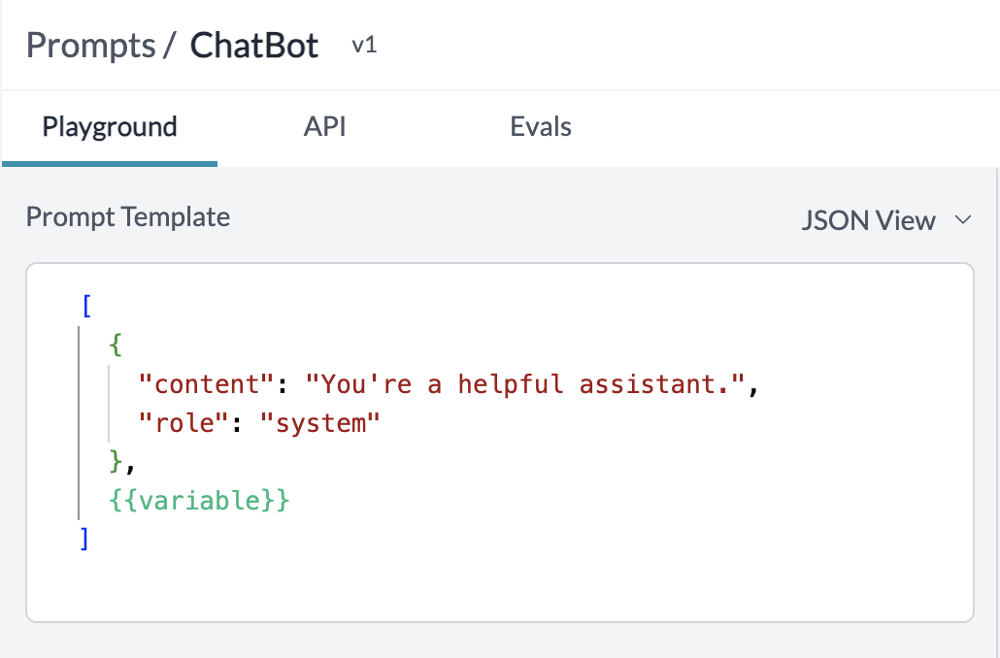

# Vision

Portkey's AI gateway supports vision models like GPT-4V by OpenAI, Gemini by Google and more.&#x20;


#### What are vision models?

Vision models are artificial intelligence systems that combine both vision and language modalities to process images and natural language text. These models are typically trained on large image and text datasets with different structures based on the pre-training objective.


### Vision Chat Completion Usage

Portkey supports the OpenAI signature to define messages with images as part of the API request. Images are made available to the model in two main ways: by passing a link to the image or by passing the base64 encoded image directly in the request.

Here's an example using OpenAI's `gpt-4-vision-preview` model



```javascript
import Portkey from 'portkey-ai';

// Initialize the Portkey client
const portkey = new Portkey({
    apiKey: "PORTKEY_API_KEY",  // Replace with your Portkey API key
    virtualKey: "VIRTUAL_KEY"   // Add your provider's virtual key
});

// Generate a chat completion with streaming
async function getChatCompletionFunctions(){
  const response = await portkey.chat.completions.create({
    model: "gpt-4-vision-preview",
    messages: [
      {
        role: "user",
        content: [
          { type: "text", text: "What’s in this image?" },
          {
            type: "image_url",
            image_url:
              "https://upload.wikimedia.org/wikipedia/commons/thumb/d/dd/Gfp-wisconsin-madison-the-nature-boardwalk.jpg/2560px-Gfp-wisconsin-madison-the-nature-boardwalk.jpg",
          },
        ],
      },
    ],
  });
  
  console.log(response)

}
await getChatCompletionFunctions();
```



```python
from portkey_ai import Portkey

# Initialize the Portkey client
portkey = Portkey(
    api_key="PORTKEY_API_KEY",  # Replace with your Portkey API key
    virtual_key="VIRTUAL_KEY"   # Add your provider's virtual key
)


response = portkey.chat.completions.create(
    model="gpt-4-vision-preview",
    messages=[
        {
            "role": "user",
            "content": [
                {"type": "text", "text": "What’s in this image?"},
                {
                    "type": "image_url",
                    "image_url": "https://upload.wikimedia.org/wikipedia/commons/thumb/d/dd/Gfp-wisconsin-madison-the-nature-boardwalk.jpg/2560px-Gfp-wisconsin-madison-the-nature-boardwalk.jpg",
                },
            ],
        }
    ],
    max_tokens=300,
)

print(completion)
```



```javascript
import OpenAI from 'openai'; // We're using the v4 SDK
import { PORTKEY_GATEWAY_URL, createHeaders } from 'portkey-ai'

const openai = new OpenAI({
  apiKey: 'OPENAI_API_KEY', // defaults to process.env["OPENAI_API_KEY"],
  baseURL: PORTKEY_GATEWAY_URL,
  defaultHeaders: createHeaders({
    provider: "openai",
    apiKey: "PORTKEY_API_KEY" // defaults to process.env["PORTKEY_API_KEY"]
  })
});

// Generate a chat completion with streaming
async function getChatCompletionFunctions(){
  const response = await openai.chat.completions.create({
    model: "gpt-4-vision-preview",
    messages: [
      {
        role: "user",
        content: [
          { type: "text", text: "What’s in this image?" },
          {
            type: "image_url",
            image_url:
              "https://upload.wikimedia.org/wikipedia/commons/thumb/d/dd/Gfp-wisconsin-madison-the-nature-boardwalk.jpg/2560px-Gfp-wisconsin-madison-the-nature-boardwalk.jpg",
          },
        ],
      },
    ],
  });
  
  console.log(response)

}
await getChatCompletionFunctions();
```



```python
from openai import OpenAI
from portkey_ai import PORTKEY_GATEWAY_URL, createHeaders

openai = OpenAI(
    api_key='OPENAI_API_KEY',
    base_url=PORTKEY_GATEWAY_URL,
    default_headers=createHeaders(
        provider="openai",
        api_key="PORTKEY_API_KEY"
    )
)

response = openai.chat.completions.create(
    model="gpt-4-vision-preview",
    messages=[
        {
            "role": "user",
            "content": [
                {"type": "text", "text": "What’s in this image?"},
                {
                    "type": "image_url",
                    "image_url": "https://upload.wikimedia.org/wikipedia/commons/thumb/d/dd/Gfp-wisconsin-madison-the-nature-boardwalk.jpg/2560px-Gfp-wisconsin-madison-the-nature-boardwalk.jpg",
                },
            ],
        }
    ],
    max_tokens=300,
)

print(completion)
```



```bash
curl "https://api.portkey.ai/v1/chat/completions" \
  -H "Content-Type: application/json" \
  -H "x-portkey-api-key: $PORTKEY_API_KEY" \
  -H "x-portkey-provider: openai" \
  -H "Authorization: Bearer $OPENAI_API_KEY" \
  -d '{
    "model": "gpt-4-vision-preview",
    "messages": [
      {
        "role": "user",
        "content": [
          {
            "type": "text",
            "text": "What’s in this image?"
          },
          {
            "type": "image_url",
            "image_url": {
              "url": "https://upload.wikimedia.org/wikipedia/commons/thumb/d/dd/Gfp-wisconsin-madison-the-nature-boardwalk.jpg/2560px-Gfp-wisconsin-madison-the-nature-boardwalk.jpg"
            }
          }
        ]
      }
    ],
    "max_tokens": 300
  }'
```



#### [API Reference](vision.md#vision-chat-completion-usage)

On completion, the request will get logged in the logs UI where any image inputs or outputs can be viewed. Portkey will automatically load the image URLs or the base64 images making for a great debugging experience with vision models.

<figure><figcaption></figcaption></figure>

### Creating prompt templates for vision models&#x20;

Portkey's prompt library supports creating templates with image inputs. If the same image will be used in all prompt calls, you can save it as part of the template's image URL itself. Or, if the image will be sent via the API as a variable, add a variable to the image link.

<figure><figcaption></figcaption></figure>

### Supported Providers and Models

The following providers are supported for image generation with more providers getting added soon. Please raise a [request](../../../welcome/integration-guides/suggest-a-new-integration.md) or a [PR](https://github.com/Portkey-AI/gateway/pulls) to add model or provider to the AI gateway.

| Provider                                                            | Models                  | Functions              |
| ------------------------------------------------------------------- | ----------------------- | ---------------------- |
| [OpenAI](../../../welcome/integration-guides/openai.md)             | `gpt-4-vision-preview`  | Create Chat Completion |
| [Azure OpenAI](../../../welcome/integration-guides/azure-openai.md) | `gpt-4-vision-preview`  | Create Chat Completion |
| [Gemini](../../../welcome/integration-guides/google-palm-1.md)      | `gemini-1.0-pro-vision` | Create Chat Completion |
