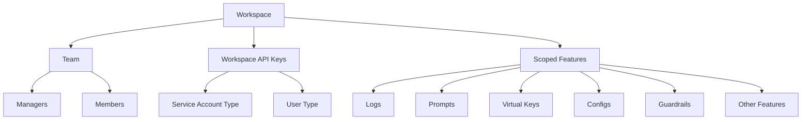

# Workspaces

## Workspaces

Workspaces in Portkey are sub-organizations that enable better separation of data, teams, scope, and visibility within your larger organization.&#x20;

They provide a more granular level of control and organization, allowing you to structure your projects and teams efficiently.

Key features of Workspaces:

* **Team Management:** You can add team members to workspaces with specific roles (manager or member), allowing for precise access control.
* **Feature Scoping:** All Portkey features such as Logs, Prompts, Virtual Keys, Configs, Guardrails, and others are scoped within a workspace, ensuring data separation and project-specific configurations.
* **Dedicated API Keys:** Workspaces contain their own API keys, which can be of two types:
  * Service Account type: For automated processes and integrations
  * User type: For individual user access&#x20;
  * Both these types of keys are scoped to the workspace by default and can only execute actions within that workspace.
* **Completion API Scoping:** Completion APIs are always scoped by workspace and can only be accessed using workspace API keys.
* **Admin Control:** While only org admins can create workspaces, managers can add API keys and team members with roles to existing workspaces.
* **Flexible Updates:** When making updates to entities via admin keys (at the org level), you can specify the `workspace_id` to target specific workspaces.

Workspaces provide a powerful way to organize your projects, teams, and resources within your larger organization, ensuring proper access control and data separation.

This structure allows for efficient management of resources and access within each workspace, providing a clear separation between different projects or teams within your organization.

### Related Topics

* [Organizations](organizations.md)
* [User Roles and Permissions](user-roles-and-permissions.md)
* [API Keys](api-keys-authn-and-authz.md)
