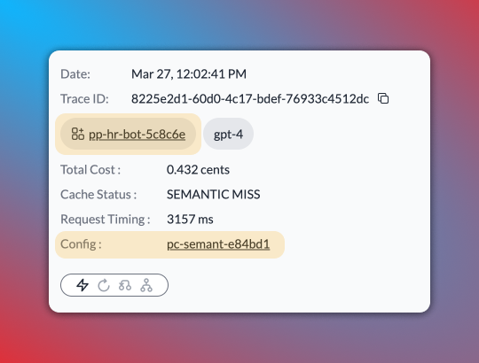
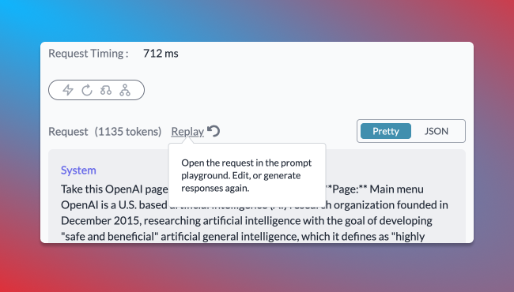
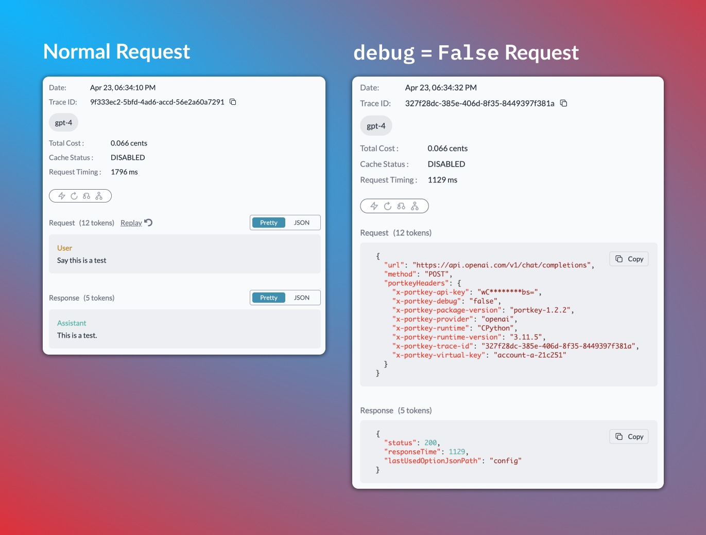

# Logs

The Logs section presents a chronological list of all the requests processed through Portkey. Each log entry provides useful data such as the timestamp, request type, LLM used, tokens generated, and cost. For [multimodal models](../ai-gateway-streamline-llm-integrations/multimodal-capabilities/), Logs will also show the image sent with vision/image models, as well as the image generated.

By clicking on an entry, a side panel opens up, revealing the entire raw data with the request and response objects.

This detailed log can be invaluable when troubleshooting issues or understanding specific interactions. It provides full transparency into each request and response, enabling you to see exactly what data was sent and received.

<figure><figcaption></figcaption></figure>

## Share Logs with Teammates

Each log on Portkey has a unique URL. You can copy the link from the address bar and directly share it with anyone in your org.

## Request Status Guide

The Status column on the Logs page gives you a snapshot of the gateway activity for every request.

Portkey’s gateway features—[Cache](broken-reference), [Retries](broken-reference), [Fallback](broken-reference), [Loadbalance](broken-reference)—are all tracked here with their exact states (`disabled`, `triggered`, etc.), making it a breeze to monitor and optimize your usage.

**Common Queries Answered:**

* **Is the cache working?**: Enabled caching but unsure if it's active? The Status column will confirm it for you.
* **How many retries happened?**: Curious about the retry count for a successful request? See it in a glance.
* **Fallback and Loadbalance**: Want to know if load balance is active or which fallback option was triggered? See it in a glance.

<figure><figcaption></figcaption></figure>

<table><thead><tr><th width="195">Option</th><th width="238">🔴 Inactive State</th><th>🟢 Possible Active States</th></tr></thead><tbody><tr><td><strong>Cache</strong></td><td>Cache Disabled</td><td>
Cache Miss,

Cache Refreshed,

Cache Hit,

Cache Semantic Hit
</td></tr><tr><td><strong>Retry</strong></td><td>Retry Not Triggered</td><td>
Retry Success on {x} Tries,

Retry Failed
</td></tr><tr><td><strong>Fallback</strong></td><td>Fallback Disabled</td><td>Fallback Active</td></tr><tr><td><strong>Loadbalance</strong></td><td>Loadbalancer Disabled</td><td>Loadbalancer Active</td></tr></tbody></table>

## Manual Feedback

As you're viewing logs, you can also add manual feedback on the logs to be analysed and filtered later. This data can be viewed on the [feedback analytics dashboards](analytics.md#feedback).

<figure><figcaption></figcaption></figure>

## Configs & Prompt IDs in Logs

If your request has an attached [Config](../ai-gateway-streamline-llm-integrations/configs.md) or if it's originating from a [prompt template](../prompt-library.md), you can see the relevant Config or Prompt IDs separately in the log's details on Portkey. And to dig deeper, you can just click on the IDs and Portkey will take you to the respective Config or Prompt playground where you can view the full details.

<figure><figcaption></figcaption></figure>

## Debug Requests with Log Replay

You can rerun any buggy request with just one click, straight from the log details page. The `Replay` button opens your request in a fresh prompt playground where you can rerun the request and edit it right there until it works.

<figure><figcaption></figcaption></figure>


**`Replay` button will be inactive for a log in the following cases:**

1. If the request is sent to any endpoint other than `/chat/completions,` `/completions`, `/embeddings`
2. If the virtual key used in the log is archived on Portkey
3. If the request originates from a prompt template which is called from inside a Config target


## DO NOT TRACK

The `DO NOT TRACK` option allows you to process requests without logging the request and response data. When enabled, only high-level statistics like **tokens** used, **cost**, and **latency** will be recorded, while the actual request and response content will be omitted from the logs.

This feature is particularly useful when dealing with sensitive data or complying with data privacy regulations. It ensures that you can still capture critical operational metrics without storing potentially sensitive information in your logs.

To enable `DO NOT TRACK` for a specific request, set the **`debug`** flag to **`false`** when instantiating your **Portkey** or **OpenAI** client, or include the **`x-portkey-debug:false`** header with your request.



<pre class="language-typescript"><code class="lang-typescript">import Portkey from 'portkey-ai';

const portkey = new Portkey({
    virtualKey: "OPENAI_VIRTUAL_KEY",
    apiKey: "PORTKEY_API_KEY",
<strong>    debug: false
</strong>})

async function main(){
    const response = await portkey.chat.completions.create({
        messages: [{ role: 'user', content: '1729' }],
        model: 'gpt-4',
    });
    console.log(response.choices[0].message?.content)
}

main()
</code></pre>



<pre class="language-python"><code class="lang-python">from portkey_ai import Portkey

portkey = Portkey(
    api_key="PORTKEY_API_KEY",  
    virtual_key="OPENAI_VIRTUAL_KEY",
<strong>    debug=False
</strong>)

response = portkey.chat.completions.create(
    messages=[{'role': 'user', 'content': 'Say this is a test'}],
    model='gpt-4'
)

print(response.choices[0].message.content)
</code></pre>



<pre class="language-bash"><code class="lang-bash">curl 'https://api.portkey.ai/v1/chat/completions' \
    -H 'Content-Type: application/json' \
    -H 'x-portkey-virtual-key: $OPENAI_VIRTUAL_KEY' \
    -H 'x-portkey-api-key: $PORTKEY_API_KEY' \
<strong>    -H 'x-portkey-debug: false' \
</strong>    -d '{ 
        "model": "gpt-4",  
        "messages": [{ "role": "user", "content": "Hello" }] 
    }'
</code></pre>



<pre class="language-python"><code class="lang-python">from openai import OpenAI
from portkey_ai import PORTKEY_GATEWAY_URL, createHeaders

client = OpenAI(
    base_url=PORTKEY_GATEWAY_URL,
    default_headers=createHeaders(
        virtual_key="OPENAI_VIRTUAL_KEY",
        api_key="PORTKEY_API_KEY",
<strong>        debug=False
</strong>    )
)

chat_complete = client.chat.completions.create(
    model="gpt-4",
    messages=[{"role": "user", "content": "Say this is a test"}],
)

print(chat_complete.choices[0].message.content)
</code></pre>



<pre class="language-typescript"><code class="lang-typescript">import OpenAI from 'openai';
import { PORTKEY_GATEWAY_URL, createHeaders } from 'portkey-ai'

const openai = new OpenAI({
  baseURL: PORTKEY_GATEWAY_URL,
  defaultHeaders: createHeaders({
    virtualKey: "OPENAI_VIRTUAL_KEY",
    apiKey: "PORTKEY_API_KEY",
<strong>    debug: false
</strong>  })
});

async function main() {
  const chatCompletion = await openai.chat.completions.create({
    messages: [{ role: 'user', content: 'Say this is a test' }],
    model: 'gpt-3.5-turbo',
  });
  console.log(chatCompletion.choices);
}

main();
</code></pre>



### Side-by-side comparison on how a `debug:false` reuqest will be logged

<figure><figcaption></figcaption></figure>

