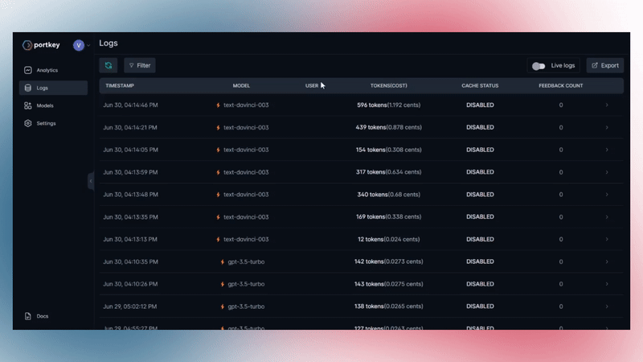

# 👣 User Journey Insights with Tracing

Trace multiple requests with a single `trace-id` and gain full visibility of user interactions on your app.

**`trace-id`** is also lets you [append feedback](#1-appending-feedback-to-the-request) on any request.

## **🔑 Add to Request Header**
```sh
'x-portkey-trace-id': 'CUSTOM_TRACE_ID'
```
Your `trace-id` should be of type `string`.

## **💡 Examples**

### **1. Appending Feedback**

You can use Portkey's Feedback API to make your prompts and user experience better by getting granular feedback on each request. Add `trace-id` to the request and append feedback through our API. 

[Go to Feedback API docs for code example](./feedback.md#🔑-two-steps-to-add-feedback).


### **2. Building on top of Langchain or Building Agents**

If you are building agents or using langchain, you end up making multiple API calls to fulfil a single user request. These requests are not chained when you want to analyse them. With `Portkey Tracing`, all the embeddings & completion requests from a single user request will get tagged with the same Trace ID.

#### **Implementing tracing with Langchain**

```python
from langchain.agents import load_tools
from langchain.agents import initialize_agent
from langchain.agents import AgentType
from langchain.llms import OpenAI
import openai

openai.api_base = "https://api.portkey.ai/v1/proxy"

llm = OpenAI(temperature=0, headers={
    "x-portkey-api-key": "<PORTKEY API KEY>",
    "x-portkey-mode": "proxy openai",
    "x-portkey-trace-id": "e4bbb7c0f6a2ff07"
})

tools = load_tools(["llm-math"], llm=llm)

agent = initialize_agent(tools, llm, agent=AgentType.ZERO_SHOT_REACT_DESCRIPTION, verbose=True)

agent.run("What is 56 multiplied by 17654 to the 0.43 power?")
```

## **🖥️ Portkey Dashboard Guide**

You can view all the requests with a common `trace-id` easily on the logs page.

